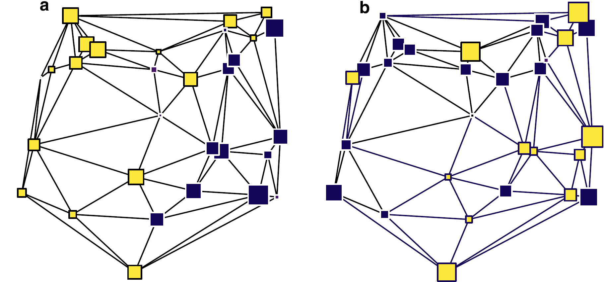
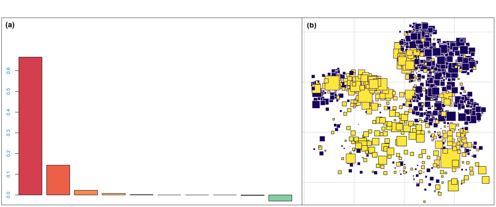
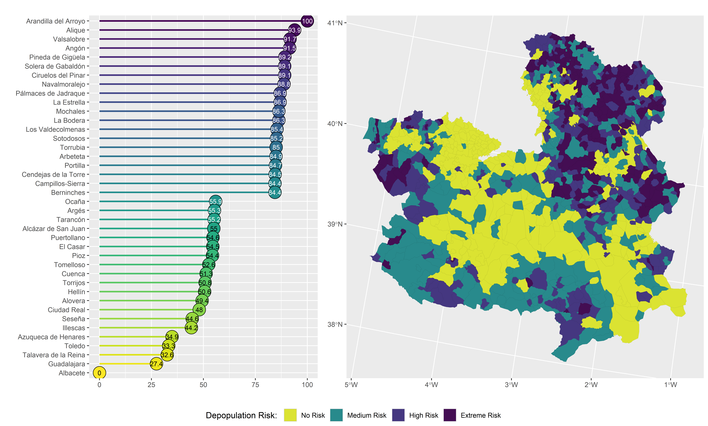

```{r, include=FALSE}
knitr::opts_chunk$set(echo = FALSE,
                      warning = FALSE,
                      tidy = FALSE,
                      message = FALSE,
                      fig.align = 'center',
                      out.width = "100%")
options(knitr.table.format = "html") 
```

::: gridContainer
::: col_1
# Abstract

Depopulation is a major problem in rural areas of the world. The main aim of this work is the construction of a Spatial Depopulation Risk Index for the 919 municipalities of Castilla-La Mancha, using geostatistical techniques and principal component analysis. The theoretical semivariogram reveals spatial dependence up to a distance of 60 kilometers. Based on this range a neighbourhood network is constructed. Then a spatial principal component analysis (sPCA) is applied to a set of demographic variables. Finally, the spatial depopulation risk index (sDRI) is designed by extracting and scaling the first principal component of the sPCA. The resulting indicator identifies the areas with depopulation risk in which counter-measures can be applied.

# Motivation

::: columns
::: {.column width="88%"}
Did you know that some areas of Cuenca y Guadalajara have [**a lower population density than Siberia**]()? Depopulation is a major problem in rural areas of Castilla-La Mancha.
:::

::: {.column width="12%"}
```{r, admir, out.width="90%", fig.align='center'}
knitr::include_graphics("PNG/!.png")
```
:::
:::

Table \@ref(tab:tabla) shows that [**445 municipalities of the region lost more than 20% of their population**](), whereas only 237 municipalities improved it in the last two decades (2001-2020).

```{r tabla}
datos <- data.frame(population = c("loss >20%", "loss 10-20%", "loss 5-10%", "loss <5%", "gain <5%", "gain 5-20%", "gain >20%"), municipalities = c(445, 131, 62, 44, 43, 67, 127))
knitr::kable(datos, col.names = c("Population Growth Rate", "Number of Municipalities"),caption = 'Number of municipalities according to growth rate between 2001 and 2020', align = c('l', 'r'),"html")
```

# Objectives

-   [**General**](): The Construction of a Spatial Depopulation Risk Index (sDRI) using spatial Principal Component Analysis to ranking the municipalities of Castilla-La Mancha in order to identify areas in which counter-measures can be applied.
-   [**Secondaries**]():
    -   To detect spatial dependence of depopulation in Castilla-La Mancha.
    -   To calculate the range of the spatial dependence.
    -   To include the spatial dependence in a depopulation risk index.
    -   To rank the municipalities of Castilla-La Mancha in terms of risk depopulation.

# Methods

As stated in the First Law of Geography: "Everything is related to everything else, but near things are more related than distant things" [**(Tobler, 1970)**](). Range of spatial dependence is extracted from the semivariogram, the heart of Geostatistics [**(Montero et al., 2015)**](), which is a tool that catch the variability, hence the spatial dependence according to the distance (see Figure \@ref(fig:fig1)). The formula of the semivariogram $\gamma(s_i,s_j)$ is: $$
\gamma(s_i-s_j) = \frac{1}{2}V((s_i)-Z(s_j)), \forall s_i,s_j\in D
$$ where: $s_i$ and $s_j$ are two locations of domain $D$, $V$ is the variance, and $Z(s)$ is the random variable of study at location $s$ (Population Growth Rate in this work).

```{r, fig1, out.width="90%", fig.align='center', dpi=1200, fig.cap="Components of a semivariogram"}
knitr::include_graphics("PNG/Fig1-Semivariogram.png")
```

Based on the adjusted range of spatial dependence, a neighbourhood network is constructed in the form of a proximity matrix $L$. Then a spatial principal component analysis [**(Jombart, T. et al., 2008)**]() is applied to ten demographic variables [**(Jato-Espino & Mayor-Vitoria, 2023)**](): population in 2001, population in 2020, youth (\<16 years) in 2020, elder (\>64 years) in 2020, growth population (2001-2020), population density (2020), natural increase rate (2010-2020), ageing index (2020), dependence index (2020) and net migration rate (2010-2020).

This set of variables define a 10-dimensional space, where Euclidean distances between the 919 entities are calculated. Finding an axis in $R^{10}$ on which the projections of the set of municipalities are as widely scattered as possible, that is, where the Euclidean distances between the entities are best preserved. To fulfil this property, a classical PCA seeks a scaled vector $u$ with $||u||^2 = 1$, containing 10 loadings (one per variable) so that the entities scores onto this axis ($\phi = Xu$) have a maximum variance.

This can be reformulated as the maximization of: $$
||Xu||^2_{1/n} = \frac{1}{n}(Xu)^TXu = \frac{1}{n}u^TX^TXu
$$

where $||Xu||^2_{1/n} = var(\phi)$. The solution is given by the first eigenvector of $\frac{1}{n}X^TX$, which yields scores whose variance is maximized and equates to the highest eigenvalue.
:::

::: col_2
::: columns
::: {.column width="40%"}
However, spatial PCA adds the constraint that the provided scores should be spatially autocorrelated and, thus, focuses on the spatial pattern of genetic variability. Two types of patterns are discriminated: global and local structures, corresponding respectively to large positive and large negative eigenvalues. This is acomplished by maximizing: $$
C(v) = V(Xv)I(Xv) = \frac{1}{n}(Xv)^TLXv = \frac{1}{n}v^TX^TLXv
$$ where $V$ is the variance, $X$ the demografic data matrix, $I()$ the Moran's $I$, which catch the spatial autocorrelation, $L$ the proximity matrix and $v$ the scaled axes in $R^{10}$, with $||v||^2 = 1$.

Figure \@ref(fig:fig2) shows the extreme theoretical possibilities. The last step is extracting and scaling the first principal component of the sPCA.
:::

::: {.column width="58%"}
```{r, fig2, out.width="95%", fig.align = 'center', dpi=1200, fig.cap = "Theoretical cases: (a) spatial dependence, (b) no spatial dependence", fig.id = TRUE}

```
:::
:::

# Results

::: columns
::: {.column width="40%"}
Figure \@ref(fig:fig3) shows the adjusted semivariogram to a spherical model, resulting in the following parameters:

\- [**range**](): 60000 meters (60 km) for the spatial dependence (around one-sixth of the regional limits),

\- [**sill**](): 3419, and

\- [**nugget**](): 1667.

```{r, fig3, fig.align = 'center', dpi=1200, fig.cap = "Semivariogram", fig.id = TRUE}
knitr::include_graphics("PNG/Fig3-Semivariogram.png")
```
:::

::: {.column width="2%"}
```{r, blanco2, fig.align = 'center'}

```
:::

::: {.column width="58%"}
```{r, fig4, fig.align = 'center', dpi=1200, fig.cap = "Principal results of spatial principal component analysis: (a) Eigenvalues of sPCA; (b) Map of sPCA scores of municipalities.", fig.id = TRUE}

```

The main results of the spatial analysis of principal components of depopulation in Castilla-La Mancha are shown in Figure \@ref(fig:fig4).

The first two eigenvalues of sPCA (\@ref(fig:fig4)[a]()) show a strong global spatial dependence, whereas the last negatives eigenvalues reveal some local dependence; this is due to municipalities acting as development hubs, consequently earning population of neighbours.

In the sPCA map (\@ref(fig:fig4)[b]()) three big areas of depopulation appear; namely the counties of Cuenca and Guadalajara, the west and the south of the region.
:::

Finally, the sDRI (\@ref(fig:fig5)) is extracted from the first component of sPCA and scaled from 0 to 100. Municipalities are then classified from Albacete (sDRI = 0) to Arandilla del Arroyo (sDRI = 100). In addition, Figure \@ref(fig:fig5) represents the sDRI in a map of Castilla-La Mancha.
:::

```{r, fig5, fig.align='center', out.width="92%", dpi=1200, fig.cap="Depopulation Risk in municipalities of Castilla-La Mancha according to sDRI"}

```


# Conclusions & Discussion

The applied spatial principal component analysis results in a Depopulation Risk Index which identifies numerous areas as having a medium to high risk of depopulation; namely, the majority of villages of Cuenca and Guadalajara, and the west and the south of the region. Conversely, it shows no risk for the areas of La Mancha and the Sagra and Henares industrial corridors, as well as the provincial capitals, Talavera de la Reina and Puertollano (see Figure \@ref(fig:fig5)).

We can conclude that Spatial Principal Component Analysis (sPCA) can be applied to demographic variables to construct an index to classify the municipalities of Castilla-La Mancha according to their depopulation risk. The scores of sDRI can be integrated into an expert system capable of identifying the areas in which counter-measures can be applied by local and regional governments.

# References

-   Jato-Espino, D.; Mayor-Vitoria, F. (2023). *A statistical and machine learning methodology to model rural depopulation risk and explore its attenuation through agricultural land use management*. Applied Geography, 152, 102870.
-   Jombart, T.; Devillard, S.; Dufour, A.-B.; Pontier, D. (2008). *Revealing cryptic spatial patterns in genetic variability by a new multivariate method*. Heredity, 101, 92-103.
-   Montero, J.M.; Fernández-Avilés, G.; Mateu, J. (2015). *Spatial and Spatio-Temporal Geostatistical Modeling and Kriging*. John Wiley & Sons.
-   Tobler, W.R. (1970). *A computer movie simulating urban growth in the Detroit region*. Economic Geography, 46-1, 234-40.
:::
:::
