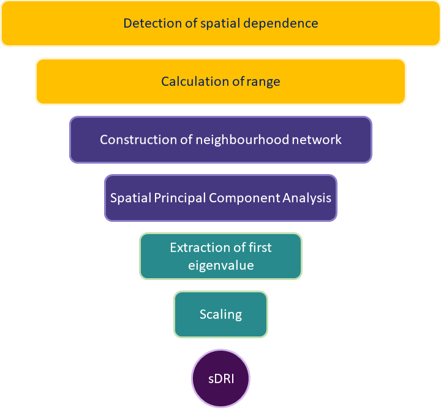
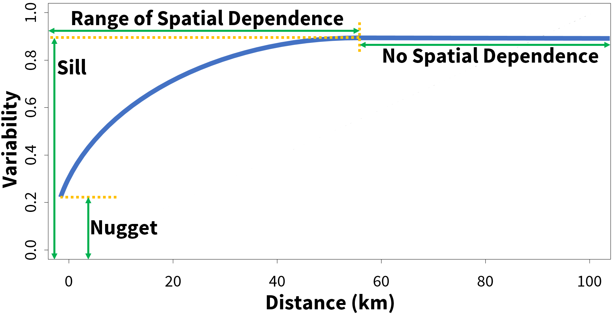
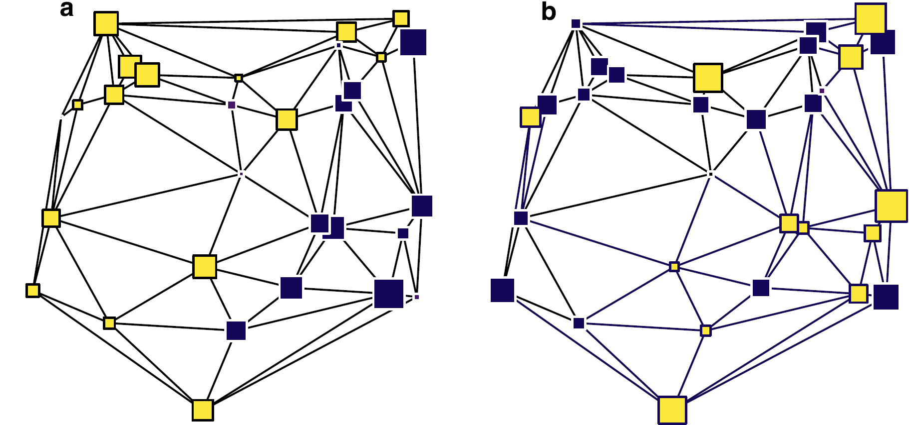
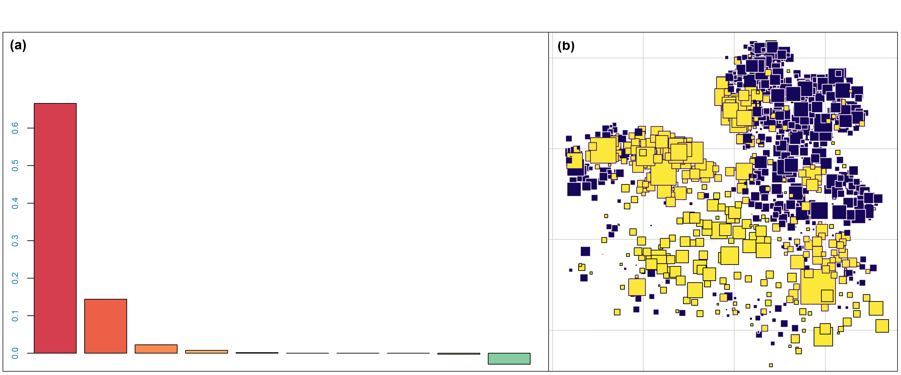
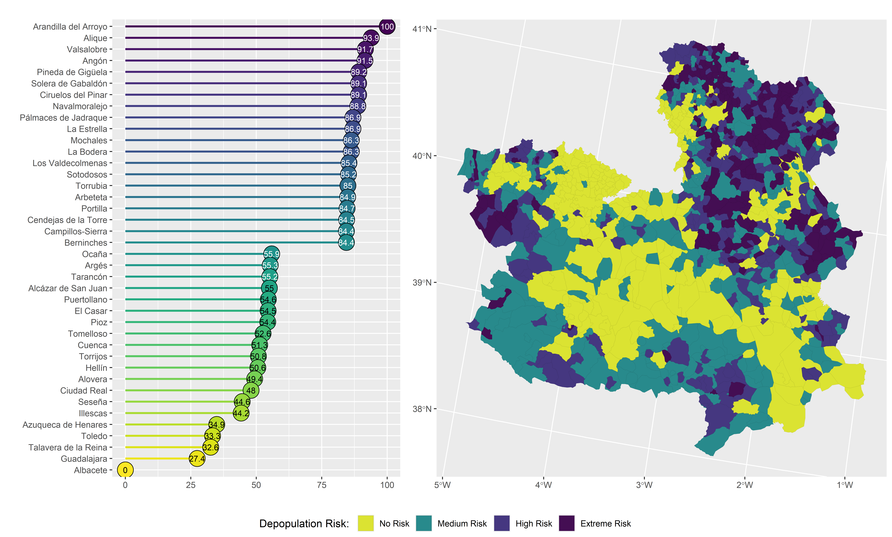

```{r, include=FALSE}
knitr::opts_chunk$set(echo = FALSE,
                      warning = FALSE,
                      tidy = FALSE,
                      message = FALSE,
                      fig.align = 'center',
                      out.width = "100%")
options(knitr.table.format = "html") 
```

::: gridContainer
::: col_1
# Abstract
Depopulation is a major problem in rural areas of the world. The main aim of this work is the construction of a Spatial Depopulation Risk Index (sDRI) for the 919 municipalities of Castilla-La Mancha, using geostatistical techniques and principal component analysis. The theoretical semivariogram reveals spatial dependence up to a distance of 60 kilometers. Based on this range a neighbourhood network is constructed. Then a spatial principal component analysis (sPCA) is applied to a set of demographic variables. Finally, the sDRI is designed by extracting and scaling the first principal component of the sPCA. The resulting indicator identifies the areas with depopulation risk in which counter-measures can be applied.

# Motivation
::: columns
::: {.column width="88%"}
Did you know that some areas of Cuenca y Guadalajara have [**a lower population density than Siberia**]()? Depopulation is a major problem in rural areas of Castilla-La Mancha.
:::

::: {.column width="12%"}
```{r, admir, out.width="80%", fig.align='center'}
knitr::include_graphics("PNG/!.png")
```
:::
:::

Table \@ref(tab:tabla) shows that [**445 municipalities of the region lost more than 20% of their population**](), whereas only 237 municipalities improved it in the last two decades (2001-2020).

```{r tabla}
datos <- data.frame(population = c("loss >20%", "loss 10-20%", "loss 5-10%", "loss <5%", "gain <5%", "gain 5-20%", "gain >20%"), municipalities = c(445, 131, 62, 44, 43, 67, 127))
knitr::kable(datos, col.names = c("Population growth rate", "Number of Municipalities"),caption = 'Number of municipalities according to growth rate between 2001 and 2020', align = c('l', 'r'),"html")
```

# Objectives
-   [**General**](): The Construction of sDRI using spatial Principal Component Analysis to ranking the municipalities of Castilla-La Mancha in order to identify areas in which counter-measures can be applied.
-   [**Secondaries**]():
    -   To detect the range of spatial dependence of depopulation in Castilla-La Mancha.
    -   To include the spatial dependence in a depopulation risk index.
    -   To rank the municipalities of Castilla-La Mancha in terms of risk depopulation.

# Methods
As stated in the First Law of Geography, "Everything is related to everything else, but near things are more related than distant things" [**(Tobler, 1970)**](). Figure \@ref(fig:fig1) stands for the methodology used in this work:

```{r, fig1, out.width="43%", fig.align='center', dpi=1200, fig.cap="Methodology"}

```
$\color{#FFC000}{\text{The range of spatial dependence is extracted from the semivariogram}}$, the instrument used *par excellence* to describe the spatial dependence in a regionalized variable [**(Montero et al., 2015)**]() (see Figure \@ref(fig:fig1)). The expression of the semivariogram $\gamma(s_i,s_j)$ is given by:
\begin{equation}
\tag{1}
\gamma(s_i-s_j) = \frac{1}{2}V((s_i)-Z(s_j)), \forall s_i,s_j\in D
\end{equation}
where $s_i$ and $s_j$ are two locations (municipalities) in the domain $D$, $V$ is the variance, and $Z(s)$ is the *Population growth rate* at location (municipality) $s$.

```{r, fig2, out.width="77%", fig.align='center', dpi=1200, fig.cap="Components of a semivariogram"}

```

Based on the adjusted semivariogram, $\color{#453780}{\text{a neighbourhood network}}$ is constructed in the form of a proximity matrix $L$. Then a $\color{#453780}{\text{spatial principal component analysis}}$ [**(Jombart, T. et al., 2008)**]() is applied to ten demographic variables [**(Jato-Espino & Mayor-Vitoria, 2023)**](): *population 2001*, *population 2020*, *youth (\<16 years) 2020*, *elder (\>64 years) 2020*, *growth population 2001-2020*, *population density  2020*, *natural increase rate 2010-2020*, *ageing index 2020*, *dependence index 2020* and *net migration rate 2010-2020*.

This set of variables define a 10-dimensional space where Euclidean distances between the 919 entities are calculated.$\color{#453780}{\text{ Spatial PCA}}$ uses the constraint that the provided scores should be spatially autocorrelated and, thus, focuses on the spatial pattern of depopulation variability.
:::

::: col_2
::: columns
::: {.column width="2%"}
```{r, blanco1, fig.align = 'center'}
knitr::include_graphics("PNG/Blanco.png")
```
:::

::: {.column width="40%"}
Two types of spatial patterns are discriminated: global and local structures, corresponding respectively to large positive and large negative eigenvalues. This is accomplished by maximizing:
\begin{equation}
\tag{2}
C(v) = V(Xv)I(Xv) = \frac{1}{n}(Xv)^TLXv = \frac{1}{n}v^TX^TLXv
\end{equation}
where $V$ is the variance, $X$ the demographic data matrix, $I()$ the Moran's $I$, which catch the spatial autocorrelation, $L$ the proximity matrix and $v$ the scaled axes in $R^{10}$, with $||v||^2 = 1$.

Figure \@ref(fig:fig2) shows the extreme theoretical possibilities.

The final steps are $\color{#288A8C}{\text{the extraction of the first principal component}}$, $\color{#288A8C}{\text{the scaling from 0 to 100}}$ and the classification of the municipalities with the $\color{#440E53}{\text{sDRI}}$.
:::

::: {.column width="58%"}
```{r, fig3, out.width="90%", fig.align = 'center', dpi=1200, fig.cap = "Theoretical cases: (a) spatial dependence, (b) no spatial dependence", fig.id = TRUE}

```
:::
:::

# Results
::: columns
::: {.column width="41%"}
This work starts with the construction of a semivariogram to analyze the spatial dependence and calculate its range. As shown in Figure \@ref(fig:fig4) the semivariogram is adjusted to a spherical model with the following parameters: [**range**]() of 60000 meters (60 km), [**sill**]() of 3419, and [**nugget**]() of 1667.

```{r, fig4, out.width="100%", fig.align = 'center', dpi=1200, fig.cap = "Adjusted semivariogram", fig.id = TRUE}
knitr::include_graphics("PNG/Fig4-Semivariogram.png")
```
Once the range of spatial dependence is estimated to 60 km, the neighbourhood network is constructed and the spatial analysis of principal components of depopulation in Castilla-La Mancha is performed. The results of the sPCA are shown in Figure \@ref(fig:fig5).
:::

::: {.column width="2%"}
```{r, blanco3, fig.align = 'center'}
knitr::include_graphics("PNG/Blanco.png")
```
:::

::: {.column width="56%"}
&nbsp;  
The first two eigenvalues of sPCA (\@ref(fig:fig5)[a]()) show a strong global spatial dependence, whereas the last negatives eigenvalues reveal some local dependence; this is due to municipalities acting as development hubs, consequently earning population of neighbours. In the sPCA map (\@ref(fig:fig5)[b]()) three big areas of depopulation appear; namely the counties of Cuenca and Guadalajara, the west and the south of the region.
```{r, fig5, out.width="90%", fig.align = 'center', dpi=1200, fig.cap = "Principal results of spatial principal component analysis: (a) Eigenvalues of sPCA; (b) Map of sPCA scores of municipalities.", fig.id = TRUE}

```
The last step of the work is to extract the first component of sPCA and scale it from 0 to 100. The resulting sDRI is used to classify the municipalities from lack of depopulation risk (sDRI = 0) to extreme risk (sDRI = 100). As shown in Figure \@ref(fig:fig6)[-left]() Albacete is the municipality with absolute abscence of depopulation risk (sDRI = 0), followed by Guadalajara, Talavera de la Reina, Toledo and Azuqueca de Henares. At the other end we have Arandilla del Arroyo (sDRI = 100), followed by Alique, Valsalobre, Angón and Pineda de Cigüela. Figure \@ref(fig:fig6)[-right]() represents the sDRI in a map of municipalities of Castilla-La Mancha.
:::
:::
```{r, fig6, fig.align='left', out.width="98%", dpi=1200, fig.cap="Depopulation Risk in municipalities of Castilla-La Mancha according to sDRI"}

```

# Conclusions & Discussion

The applied spatial principal component analysis results in a Depopulation Risk Index which identifies numerous areas as having a medium to high risk of depopulation; namely, the majority of villages of Cuenca and Guadalajara, and the west and the south of the region. Conversely, it shows no risk for the areas of La Mancha and the Sagra and Henares industrial corridors, as well as the provincial capitals, Talavera de la Reina and Puertollano (see Figure \@ref(fig:fig5)).

We can conclude that Spatial Principal Component Analysis can be applied to demographic variables to construct an index to classify the municipalities of Castilla-La Mancha according to their depopulation risk. The scores of sDRI can be integrated into an expert system capable of identifying the areas in which counter-measures can be applied by local and regional governments.

# References
-   Jato-Espino, D.; Mayor-Vitoria, F. (2023). *A statistical and machine learning methodology to model rural depopulation risk and explore its attenuation through agricultural land use management*. Applied Geography, 152, 102870.
-   Jombart, T.; Devillard, S.; Dufour, A.-B.; Pontier, D. (2008). *Revealing cryptic spatial patterns in genetic variability by a new multivariate method*. Heredity, 101, 92-103.
-   Montero, J.M.; Fernández-Avilés, G.; Mateu, J. (2015). *Spatial and Spatio-Temporal Geostatistical Modeling and Kriging*. John Wiley & Sons.
-   Tobler, W.R. (1970). *A computer movie simulating urban growth in the Detroit region*. Economic Geography, 46-1, 234-40.
:::
:::
