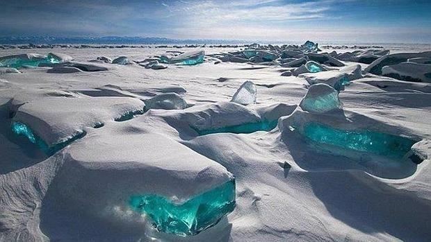

```{r, include=FALSE}
knitr::opts_chunk$set(echo = FALSE,
                      warning = FALSE,
                      tidy = FALSE,
                      message = FALSE,
                      fig.align = 'center',
                      out.width = "100%")
options(knitr.table.format = "html") 
```

::: gridContainer
::: col_1
# Introduction

::: columns
::: {.column width="45%"}
Did you know that some areas of Cuenca y Guadalajara have ***a lower population density than Siberia*** (see Figure \@ref(fig:Baikal))?
:::

::: {.column width="55%"}
```{r, Baikal, out.width="80%", fig.align='center', fig.cap="Baikal Lake at Siberia"}

```
:::
:::


In fact, Figure \@ref(fig:tasacrecdem) shows that ***444 municipalities*** of our region ***lost more than 20% of their population*** in the last two decades (Extreme Risk Zones in red):

```{r, tasacrecdem, fig.align = 'center', fig.cap = "Zones of Castilla-La Mancha Counter-depopulation Strategy", fig.id = TRUE}
knitr::include_graphics("PNG/tasa_crec_dem.png")
```

# Objectives

-   [**General**](): Construction of a Spatial Depopulation Risk Index using spatial Principal Component Analysis to ranking the municipalities of Castilla-La Mancha
-   [**Secondaries**]():
    -   to detect spatial dependence of depopulation in Castilla-La Mancha
    -   to calculate the range of the spatial dependence
    -   to include the spatial dependence in a depopulation risk index
    -   to rank the municipalities of Castilla-La Mancha in terms of risk depopulation in order to identify areas in which counter-measures can be applied

# Methods

Spatial dependence is checked with Moran's I:

$$
I= \frac{N}{\sum _{i}\sum _{j} w_{ij}} \frac {\sum _{i}\sum _{j} w_{ij} (X_i - \bar{X}) (X_j - \bar{X})} {\sum _{i} (X_i - \bar{X})^2}
$$

Range of spatial dependence is extracted from the semivariogram, the heart of Geostatistics, which is a tool that catch the spatial dependence according to the distance (see  Figure \@ref(fig:semivariogram)):

```{r, semivariogram, out.width="95%", fig.align='center', fig.cap="The semivariogram is the heart of Geostatistics"}
knitr::include_graphics("PNG/Semivariogram.png")
```
:::

::: col_2
# Results

::: columns
::: {.column width="50%"}
```{r, irisfigure, fig.cap='Here is a caption for the figure. This can be added by using the "fig.cap" option in the r code chunk options, see this [link](https://yihui.name/knitr/options/#plots) from the legend himself, [Yihui Xie](https://twitter.com/xieyihui).', out.width="80%"}
par(mar=c(2,2,0,1))
plot(x = iris$Sepal.Length, y = iris$Sepal.Width,
     col = iris$Species, pch = 19, xlab = "Sepal Length",
     ylab = "Sepal Width")
```
:::

::: {.column width="50%"}
Maybe you want to show off some of that fancy code you spent so much time on to make that figure, well you can do that too! Just use the `echo=TRUE` option in the r code chunk options, Figure \@ref(fig:myprettycode)!
:::
:::

```{r, sDRI, out.width="90%", fig.align='center'}
knitr::include_graphics("PNG/sDRI.png")
```

# References

Jombart, T.; Devillard, S.; Dufour, A.-B.; Pontier, D. *Revealing cryptic spatial patterns in genetic variability by a new multivariate method*, Heredity, 101 (2008), 92-103.
:::
:::
