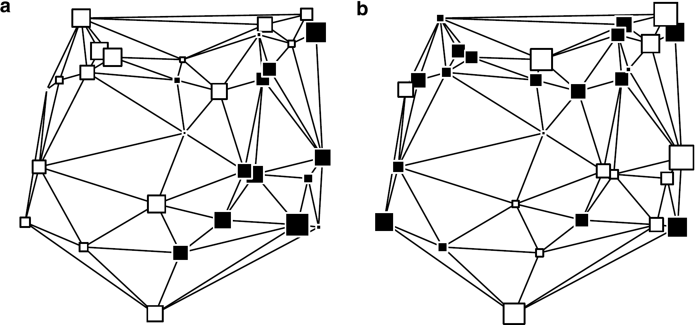

```{r, include=FALSE}
knitr::opts_chunk$set(echo = FALSE,
                      warning = FALSE,
                      tidy = FALSE,
                      message = FALSE,
                      fig.align = 'center',
                      out.width = "100%")
options(knitr.table.format = "html") 
```
::: gridContainer
::: col_1
# Abstract - Motivation
::: columns
::: {.column width="88%"}
Did you know that some areas of Cuenca y Guadalajara have **a lower population density than Siberia**? Depopulation is a major problem in rural areas of Castilla-La Mancha.
:::
::: {.column width="12%"}
```{r, admir, out.width="90%", fig.align='center'}
knitr::include_graphics("PNG/!.png")
```
:::
:::
Table \@ref(tab:tabla) shows that **445 municipalities** of the region **lost more than 20% of their population**, whereas only 237 municipalities improved it in the last two decades (2001-2020).

```{r tabla}
datos <- data.frame(population = c("loss >20%", "loss 10-20%", "loss 5-10%", "loss <5%", "gain <5%", "gain 5-20%", "gain >20%"), municipalities = c(445, 131, 62, 44, 43, 67, 127))
knitr::kable(datos, caption = 'Number of municipalities according to growth rate between 2001 and 2020', align = c('l', 'r'),"html")
```
In this work a Spatial Depopulation Risk Index is constructed for the 919 municipalities of Castilla-La Mancha, using geostatistical techniques and principal component analysis.
The identification of areas with depopulation risk will allow for applying counter-measures.

# Objectives

-   [**General**](): The Construction of a Spatial Depopulation Risk Index (sDRI) using spatial Principal Component Analysis to ranking the municipalities of Castilla-La Mancha.
-   [**Secondaries**]():
    -   To detect spatial dependence of depopulation in Castilla-La Mancha.
    -   To calculate the range of the spatial dependence.
    -   To include the spatial dependence in a depopulation risk index.
    -   To rank the municipalities of Castilla-La Mancha in terms of risk depopulation in order to identify areas in which counter-measures can be applied.

# Methods

Spatial dependence is checked with Moran's I:

$$
I= \frac{N}{\sum _{i}\sum _{j} w_{ij}} \frac {\sum _{i}\sum _{j} w_{ij} (X_i - \bar{X}) (X_j - \bar{X})} {\sum _{i} (X_i - \bar{X})^2}
$$

Range of spatial dependence is extracted from the semivariogram, the heart of Geostatistics, which is a tool that catch the spatial dependence according to the distance (see  Figure \@ref(fig:semivariogram)).

```{r, semivariogram, out.width="95%", fig.align='center', fig.cap="Components of a semivariogram"}
knitr::include_graphics("PNG/Semivariogram.png")
```
Based on the calculated range of spatial dependence, a neighborhood network is constructed. Then a spatial principal component analysis (sPCA) is applied to a set of demographic variables. Figure \@ref(fig:dependence) shows the extreme theoretical posibilities. The last step is extracting and scaling the first principal component of the sPCA.

```{r, dependence, fig.align = 'center', fig.cap = "Theoretical cases: (a) spatial dependence, (b) no spatial dependence", fig.id = TRUE}

```

:::

::: col_2
# Results

::: columns
::: {.column width="45%"}
Ideas:

+ Data

+ Mapa de sPCA dependencia y autovalores 

+ Lollipop
:::

::: {.column width="10%"}
```{r, blanco, out.width="10%"}
knitr::include_graphics("PNG/blanco.png")
```
:::

::: {.column width="45%"}

:::
:::

```{r, sDRI, out.width="90%", fig.align='center', fig.cap="Depopulation Risk in municipalities of Castilla-La Mancha according to sDRI Indicator"}
knitr::include_graphics("PNG/sDRI_fondo.png")
```

# References

Jombart, T.; Devillard, S.; Dufour, A.-B.; Pontier, D. *Revealing cryptic spatial patterns in genetic variability by a new multivariate method*, Heredity, 101 (2008), 92-103.
:::
:::
