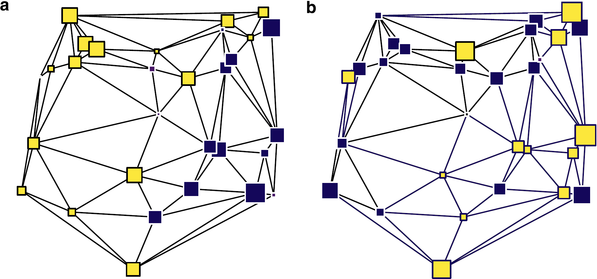

```{r, include=FALSE}
knitr::opts_chunk$set(echo = FALSE,
                      warning = FALSE,
                      tidy = FALSE,
                      message = FALSE,
                      fig.align = 'center',
                      out.width = "100%")
options(knitr.table.format = "html") 
```
::: gridContainer
::: col_1
# Abstract
Depopulation is a major problem in rural areas of the world. The main aim of this work is the construction of a Spatial Depopulation Risk Index for the 919 municipalities of Castilla-La Mancha, using geostatistical techniques and principal component analysis. The theoretical semivariogram reveals spatial dependence up to a distance of 60 kilometers. Based on this range a neighborhood network is constructed. Then a spatial principal component analysis (sPCA) is applied to a set of demographic variables. Finally, the spatial depopulation risk index (sDRI) is designed by extracting and scaling the first principal component of the sPCA. The resulting indicator identifies the areas with depopulation risk in which counter-measures can be applied.

# Motivation
::: columns
::: {.column width="88%"}
Did you know that some areas of Cuenca y Guadalajara have [**a lower population density than Siberia**]()? Depopulation is a major problem in rural areas of Castilla-La Mancha.
:::
::: {.column width="12%"}
```{r, admir, out.width="90%", fig.align='center'}
knitr::include_graphics("PNG/!.png")
```
:::
:::
Table \@ref(tab:tabla) shows that [**445 municipalities of the region lost more than 20% of their population**](), whereas only 237 municipalities improved it in the last two decades (2001-2020).

```{r tabla}
datos <- data.frame(population = c("loss >20%", "loss 10-20%", "loss 5-10%", "loss <5%", "gain <5%", "gain 5-20%", "gain >20%"), municipalities = c(445, 131, 62, 44, 43, 67, 127))
knitr::kable(datos, caption = 'Number of municipalities according to growth rate between 2001 and 2020', align = c('l', 'r'),"html")
```

# Objectives

-   [**General**](): The Construction of a Spatial Depopulation Risk Index (sDRI) using spatial Principal Component Analysis to ranking the municipalities of Castilla-La Mancha in order to identify areas in which counter-measures can be applied.
-   [**Secondaries**]():
    -   To detect spatial dependence of depopulation in Castilla-La Mancha.
    -   To calculate the range of the spatial dependence.
    -   To include the spatial dependence in a depopulation risk index.
    -   To rank the municipalities of Castilla-La Mancha in terms of risk depopulation.

# Methods

Spatial dependence is checked with Moran's I:

$$
I= \frac{N}{\sum _{i}\sum _{j} w_{ij}} \frac {\sum _{i}\sum _{j} w_{ij} (X_i - \bar{X}) (X_j - \bar{X})} {\sum _{i} (X_i - \bar{X})^2}
$$

Range of spatial dependence is extracted from the semivariogram, the heart of Geostatistics [**(Montero et al., 2015)**](), which is a tool that catch the spatial dependence according to the distance (see  Figure \@ref(fig:semivariogram)).

```{r, semivariogram, out.width="90%", fig.align='center', fig.cap="Components of a semivariogram"}
knitr::include_graphics("PNG/Semivariogram.png")
```
Based on the calculated range of spatial dependence, a neighborhood network is constructed. Then a spatial principal component analysis [**(Jombart et al., 2008)**]() is applied to a set of demographic variables [**(Jato-Espino & Mayor-Vitoria et al., 2023)**](). Figure \@ref(fig:dependence) shows the extreme theoretical posibilities. The last step is extracting and scaling the first principal component of the sPCA.

```{r, dependence, fig.align = 'center', fig.cap = "Theoretical cases: (a) spatial dependence, (b) no spatial dependence", fig.id = TRUE}

```

:::

::: col_2
# Results & Discussion

::: columns
::: {.column width="59%"}
```{r, resultados, fig.align = 'center', fig.cap = "Principal results of spatial principal component analysis (range: 60km): (a) Semivariogram; (b) Eigenvalues of sACP; (c) sPCA scores of municipalities; (d) Indicator of extreme municipalities", fig.id = TRUE}
knitr::include_graphics("PNG/Results_color.png")
```

:::
::: {.column width="2%"}
```{r, blanco, fig.align = 'center'}
knitr::include_graphics("PNG/Blanco.png")
```
:::
::: {.column width="39%"}
Figure \@ref(fig:resultados) shows the main results of the spatial analysis of principal components of depopulation in Castilla-La Mancha. The semivariogram catched a range for the spatial dependence of 60 km (\@ref(fig:resultados)[a]()). The first two eigenvalues of sPCA  (\@ref(fig:resultados)[b]()) show a strong global spatial dependence, whereas the last negatives eigenvalues reveal some local dependence; this is due to municipalities acting as development hubs, consequently earning population of neighbours. The sPCA map (\@ref(fig:resultados)[c]()) shows three big areas of depopulation; namely the counties of Cuenca and Guadalajara, the west and the south of the region. Finally, the sDRI (\@ref(fig:resultados)[d]()) is extracted from the first component of sPCA and scaled from 0 to 100. Municipalities are then classified from Albacete (sDRI = 0) to Arandilla del Arroyo (sDRI = 100).

:::
:::


The applied spatial principal component analysis results in a Depopulation Risk Index which identifies numerous areas as having a medium to high risk of depopulation; namely, the majority of villages of Cuenca and Guadalajara, and the west and the south of the region. Conversely, it shows no risk for the areas of La Mancha and the Sagra and Henares industrial corridors, as well as the provincial capitals, Talavera de la Reina and Puertollano (see Figure nº \@ref(fig:sDRI)).

We can conclude that Spatial Principal Component Analysis (sPCA) can be applied to demographic variables to construct an index capable of classify the municipalities of Castilla-La Mancha according to their depopulation risk, identifying the areas in which counter-measures can be applied.

```{r, sDRI, out.width="102%", fig.align='center', fig.cap="Depopulation Risk in municipalities of Castilla-La Mancha according to sDRI Indicator"}
knitr::include_graphics("PNG/sDRI_fondo.png")
```
# References
- Jato-Espino, D.; Mayor-Vitoria, F. (2023). *A statistical and machine learning methodology to model rural depopulation risk and explore its attenuation through agricultural land use management*. Applied Geography, 152, 102870.
- Jombart, T.; Devillard, S.; Dufour, A.-B.; Pontier, D. (2008). *Revealing cryptic spatial patterns in genetic variability by a new multivariate method*. Heredity, 101, 92-103.
- Montero, J.M.; Fernández-Avilés, G.; Mateu, J. (2015). *Spatial and Spatio-Temporal Geostatistical Modeling and Kriging*. John Wiley & Sons

:::
:::
